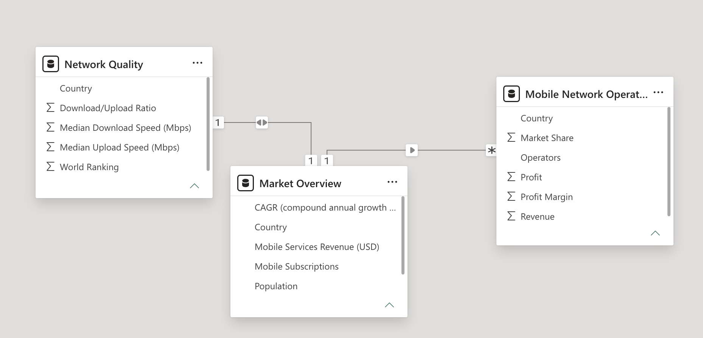
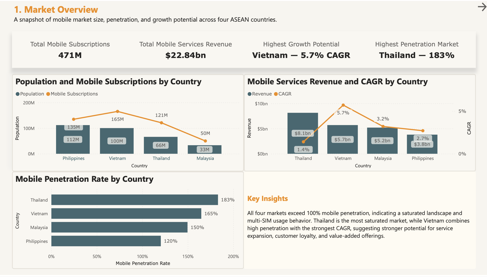
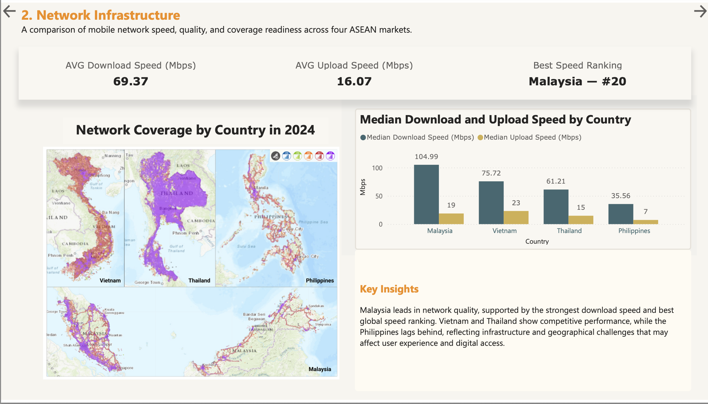
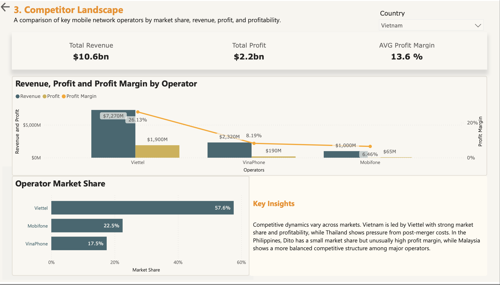

# ASEAN Mobile Network Usage Research Dashboard

## Project Overview

This project combines secondary research and Power BI dashboarding to analyze mobile network usage across four ASEAN markets: Vietnam, Thailand, the Philippines, and Malaysia.

The research paper explores market size, mobile penetration, technology adoption, network infrastructure, network quality, and operator competition. The Power BI dashboard then translates these findings into a concise visual report to compare market maturity, infrastructure readiness, and competitive dynamics across the four countries.

## Project Objectives

This project aims to answer the following questions:

* Which country shows the strongest mobile market growth potential?
* How do mobile penetration rates differ across Vietnam, Thailand, the Philippines, and Malaysia?
* Which market demonstrates stronger network quality and infrastructure readiness?
* How competitive is each market in terms of operator market share, revenue, profit, and profitability?
* What strategic implications can be drawn from market maturity, network performance, and operator competition?

## Project Components

### 1. Research Paper

The research paper provides the foundation for the dashboard. It includes research objectives, secondary data sources, market overview, infrastructure analysis, competitor landscape, key findings, trends, challenges, and references.

### 2. Power BI Dashboard

The Power BI dashboard summarizes the research into three main pages:

1. **Market Overview**
   Compares population, mobile subscriptions, mobile penetration rate, mobile services revenue, and CAGR across the four markets.

2. **Network Infrastructure**
   Analyzes median download speed, median upload speed, global speed ranking, and network coverage readiness.

3. **Competitor Landscape**
   Compares key mobile network operators by market share, revenue, profit, and profit margin.

### 3. Data Model

The dashboard is built using three key tables:

* **Market Overview**: population, mobile subscriptions, penetration rate, mobile services revenue, and CAGR
* **Network Quality**: median download speed, median upload speed, download/upload ratio, and world ranking
* **Mobile Network Operators**: operator market share, revenue, profit, and profit margin

These tables are connected through the **Country** field to support cross-page filtering and country-level analysis.



## Dashboard Preview

### Page 1: Market Overview



### Page 2: Network Infrastructure



### Page 3: Competitor Landscape



## Key Insights

* All four markets have mobile penetration rates above 100%, indicating mature and highly penetrated mobile landscapes.
* Vietnam combines high mobile penetration with the strongest CAGR, suggesting stronger potential for service expansion and value-added offerings.
* Malaysia leads in network quality, supported by the strongest median download speed and best global speed ranking among the four markets.
* The Philippines shows a wider infrastructure gap, reflecting geographical and network coverage challenges that may affect user experience and digital access.
* Competitive dynamics vary by country, with leading operators typically combining stronger market share with better financial performance.

## Tools Used

* Power BI
* Power Query
* DAX
* Excel
* Secondary Research
* Data Visualization
* Data Modeling

## Repository Structure

```text
ASEAN-Mobile-Network-Usage-Research-Dashboard/
│
├── Assets/
│   ├── data_model_relationship_view.png
│   ├── page_1_market_overview.png
│   ├── page_2_network_infrastructure.png
│   └── page_3_competitor_landscape.png
│
├── Dashboard/
│   ├── [Dashboard] Mobile Network Usage in Vietnam, Thailand, the Philippines, and Malaysia.pbix
│   └── [Dashboard] Mobile Network Usage in Vietnam, Thailand, the Philippines, and Malaysia.pdf
│
├── Research Paper/
│   └── [Research Paper] Mobile Network Usage in Vietnam, Thailand, Philippines, Malaysia.pdf.pdf
│
└── README.md
```

## Files

* **Research Paper**: full research report with market context, methodology, findings, and references
* **Dashboard PDF**: exported version of the final Power BI dashboard
* **PBIX File**: editable Power BI dashboard file
* **Assets**: dashboard page previews and data model screenshot

## Project Type

**Market Research | Power BI Dashboard | Data Modeling | Data Visualization**
